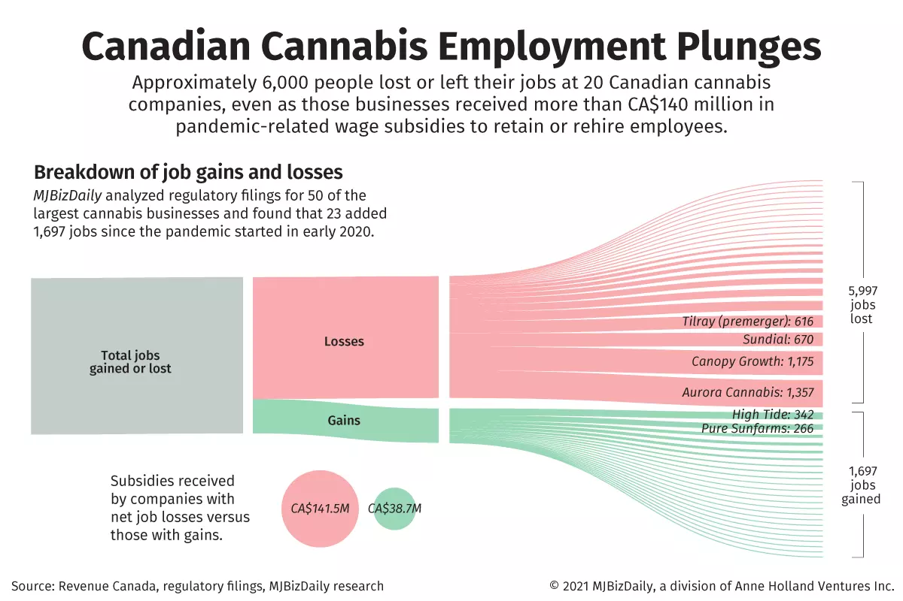

# 
 Der Weißmarkt Ist Auch Ein Mistkerl 

### Kanada I:

Nein, leider nicht!  
Es ist ebenso kein Einzelfall wie das über 140 Mil. staatlicher, kanadischer Covid-Subventionen, von den größten Playern, genutzt wurden um knapp 6.000 Cannabisworker zu entlassen.  
\- **allerdings auf der anderen Seite** -  
kleine Player nicht mal 40 Mil. nötig hatten um das Personal um fast 1.700 Personen zu erhöhen.  
**Nicht einer der 9 größten... der nicht**... *"Betrogen"* hätte...

 

 

1st | [Prev](CaNoKo-Folien.md) | [Next](Canada2.md)
