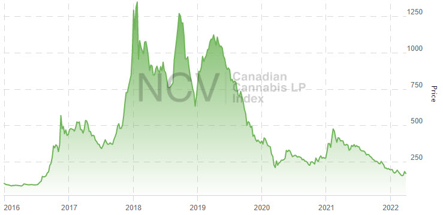

# 
 Mist Bleibt Mist 

### Kanada II:

Das die "BigPlayer" überhaupt vorwiegend talentiert Geld vernichten statt es zu vermehren hat System:

Man kann an dieser Grafik aber auch sehen wann ein Teil der Überregulierung aufgegeben und mit den Mikrolizenzen begonnen wurde.  
Ebenso sieht man den PayOutDay der "zu vernichtenden" Covid-Subventionen...  
*...und schon zerfließt meine Sprechzeit wie das Geld der Investoren...*

 

[1st](CaNoKo-Folien.md) | [Prev](Canada1.md) | [Next](BlackMarket1.md)
